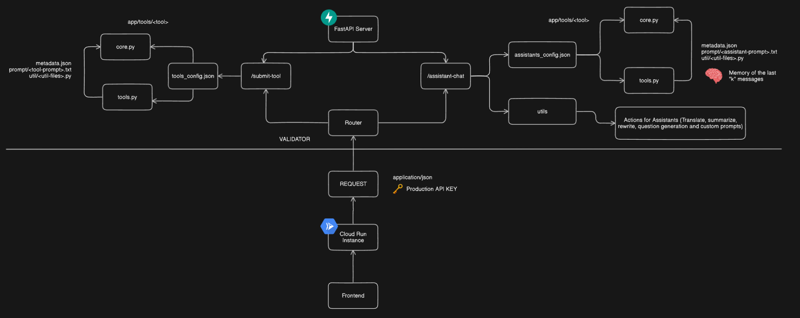

# Kai AI Platform


## Table of Contents

- [Architecture](#Architecture)
- [Folder Structure](#folder-structure)
- [Setup](#Setup)
- [Local Development](#local-development)
- [Contributing](#Contributing)


## Folder Structure
```plaintext
backend/
├── app/                     # Contains the main application code
│   ├── Api/                 # Contains the API router for handling requests
│   │   └── router.py        # Endpoints for FastAPI to test features and handle incoming requests
│   ├── chats/               # Handles chat functionalities
│   ├── Features/            # Contains feature-specific modules
│   │   ├── Feature1/
│   │   │   ├── core.py
│   │   │   ├── tools.py
│   │   │   ├── Prompt
│   │   │   └── metadata.json
│   │   ├── Feature2/
│   │   │   ├── core.py
│   │   │   ├── tools.py
│   │   │   ├── Prompt
│   │   │   └── metadata.json
│   ├── services/            # Contains service modules
│   ├── utils/               # Contains utility modules
│   ├── app.yaml             # Application configuration file
│   ├── Dependencies.py      # Dependency management
│   ├── Main.py              # Main entry point for the application
│   └── requirements.txt     # Python dependencies
├── Dockerfile               # Dockerfile for containerizing the application
└── README.md                # Documentation file
```
## Install all the necessary libraries:


```bash
  pip install -r requirements.txt

```
## To Run Locally and Test 

## Prerequisites

- A Google Cloud account.
- Access to the Google Cloud Platform console.

## Steps for Authentication Setup

### Step 1: Create a Service Account

1. Navigate to the [Google Cloud Console](https://console.cloud.google.com/).
2. Go to **IAM & Admin** > **Service Accounts**.
3. Click **Create Service Account**.
4. Enter a name and description for the service account.
5. Click **Create**.
6. Assign the necessary roles to the service account (e.g., Editor, Viewer).
7. Click **Continue** and then **Done** to finish creating the service account.

### Step 2: Download the Service Account Key

1. In the **Service Accounts** page, click on the newly created service account.
2. Go to the **Keys** tab.
3. Click **Add Key**, then select **Create new key**.
4. Choose **JSON** as the key type and click **Create**.
5. The key will be downloaded automatically. Save this file securely.

### Step 3: Rename and Store the Key

1. Rename the downloaded JSON key to `local-auth.json`.
2. Move or copy this file to your application's directory, specifically inside the `/app` directory.

### Step 4: Set Environment Variables

1. Open your command line interface.
2. Set the path to the JSON key file by running:
   ```bash
   set GOOGLE_APPLICATION_CREDENTIALS=/app/local-auth.json```
## Set the environment type and project ID:


```bash
  set ENV_TYPE="dev"
  set PROJECT_ID="Enter your project ID here"

```

```bash
  uvicorn main:app --reload
```


# Docker Setup Guide

## Overview

This guide is designed to help contributors set up and run the backend service using Docker. Follow these steps to ensure that your development environment is configured correctly.

## Prerequisites

Before you start, ensure you have the following installed:
- Docker


## Installation Instructions

### 1. Setting Up Local Credentials
Obtain a local-auth.json file which contains the Google service account credentials and place it in the root of the app/ directory within your project.

### 2. Build the Docker Image
Navigate to the project's root directory and build the Docker image:
``` Bash
docker build -f backend/Dockerfile -t kai-backend:latest .

```
### 3 Run the Docker Container

Run the Docker container using the following command:
``` bash
docker run -d -p 8000:8000 --name kai-backend kai-backend:latest
```
This command starts a detached container that maps port 8000 of the container to port 8000 on the host.

## Environment Variables
The Docker container uses several key environment variables:

-  GOOGLE_APPLICATION_CREDENTIALS points to /app/local-auth.json.
-  ENV_TYPE set to "sandbox" for development.
- PROJECT_ID specifies your Google Cloud project ID.
- LangChain API integration is configured via:
`LANGCHAIN_TRACING_V2`
`LANGCHAIN_ENDPOINT`
`LANGCHAIN_API_KEY`
`LANGCHAIN_PROJECT`
- Ensure these variables are correctly configured in your Dockerfile or passed as additional parameters to your Docker run command if needed.
## Accessing the Application
You can access the backend by visiting:
```Bash
http://localhost:8000

```

After your container starts, you should see the FastAPI landing page, indicating that the application is running successfully.
## DocString for core.py

how you might add docstrings to the executor function in your core.py file. These docstrings include a brief description of the function, detailed parameter descriptions, and the expected return value.

```bash
from fastapi import UploadFile
from typing import List

def executor(files: List[str], topic: str, num_questions: int) -> List[str]:
    """
    Process a list of files to generate a specified number of quiz questions based on the provided topic.

    Parameters:
    files (List[str]): A list of file paths pointing to the documents from which quiz questions will be generated.
    topic (str): The subject or theme of the quiz questions.
    num_questions (int): The number of quiz questions to generate.

    Returns:
    List[str]: A list of quiz questions.

    Notes:
    The function uses a RAGpipeline configured with a LocalFileLoader to process the files. The files are first loaded and 
    compiled into a database representation by the RAGpipeline, and then quiz questions are constructed by the QuizBuilder based on the topic.
    """
    from features.quizzify.tools import RAGpipeline
    from features.quizzify.tools import QuizBuilder
    from features.quizzify.tools import LocalFileLoader  # Updated loader
    
    print(f"Files: {files}")

    # Instantiate RAG pipeline with the local file loader
    pipeline = RAGpipeline(loader=LocalFileLoader)
    
    # Compile the pipeline
    pipeline.compile()

    # Process the uploaded files
    db = pipeline(files)
    
    print(f"{__name__} Executing quiz builder")
    
    print(f"Type of db: {type(db)}")
    print(f"Other variable types: {type(topic)}, {type(num_questions)}")
    
    # Create and return the quiz questions
    return QuizBuilder(db, topic).create_questions(num_questions)

```


## In this docstring:

The Parameters section explains each input parameter.

The Returns section describes what the function returns.

The Notes section gives additional context about how the function operates internally, which can be useful for understanding dependencies and the function’s logic.

## DocString for Tools.py

```bash
from typing import List, Tuple, Optional
from io import BytesIO
from fastapi import UploadFile
from PyPDF2 import PdfReader
from langchain_core.document_loaders import BaseLoader
from langchain_core.documents import Document
from langchain_text_splitters import RecursiveCharacterTextSplitter
from langchain_chroma import Chroma
from langchain_google_vertexai import VertexAIEmbeddings, VertexAI
from services.schemas import GCS_File
from services.gcp import setup_logger
from langchain_core.prompts import PromptTemplate
from langchain_core.runnables import RunnablePassthrough, RunnableParallel
from langchain_core.output_parsers import JsonOutputParser
from langchain_core.pydantic_v1 import BaseModel, Field
import json
import os

logger = setup_logger()

def read_text_file(file_path: str) -> str:
    """
    Reads the content of a text file and returns it as a string.

    Parameters:
    file_path (str): The relative path to the text file from the script's location.

    Returns:
    str: The content of the file as a string.
    """
    script_dir = os.path.dirname(os.path.abspath(__file__))
    absolute_file_path = os.path.join(script_dir, file_path)
    with open(absolute_file_path, 'r') as file:
        return file.read()

class RAGRunnable:
    """
    A wrapper class that allows chaining of function calls in a pipeline.

    Attributes:
    func (Callable): The function to wrap.
    """
    def __init__(self, func):
        self.func = func

    def __or__(self, other):
        """
        Overrides the bitwise OR operator to chain this runnable with another.
        
        Parameters:
        other (RAGRunnable): Another runnable to chain with this one.

        Returns:
        RAGRunnable: A new runnable representing the chained function.
        """
        def chained_func(*args, **kwargs):
            return other(self.func(*args, **kwargs))
        return RAGRunnable(chained_func)

    def __call__(self, *args, **kwargs):
        """
        Calls the wrapped function.
        """
        return self.func(*args, **kwargs)

class UploadPDFLoader:
    """
    Loads PDF files from UploadFile instances, extracting their text content as documents.

    Attributes:
    files (List[UploadFile]): A list of UploadFile instances containing the files to load.
    """
    def __init__(self, files: List[UploadFile]):
        self.files = files

    def load(self) -> List[Document]:
        """
        Processes all provided PDF files and extracts their text content as documents.

        Returns:
        List[Document]: A list of Document objects containing the extracted text and metadata.
        """
        documents = []
        for upload_file in self.files:
            with upload_file.file as pdf_file:
                pdf_reader = PdfReader(pdf_file)
                for i, page in enumerate(pdf_reader.pages):
                    page_content = page.extract_text()
                    metadata = {"source": upload_file.filename, "page_number": i + 1}
                    documents.append(Document(page_content=page_content, metadata=metadata))
        return documents


```

## For this DocString
For BytesFileLoader, LocalFileLoader, RAGpipeline, QuestionChoice, QuizQuestion, and QuizBuilder, you would continue in a similar fashion. Each docstring should:

1) Clearly describe what the class or function does.
2) Detail the parameters with types and descriptions.
3) Explain the return type and the value expected.
